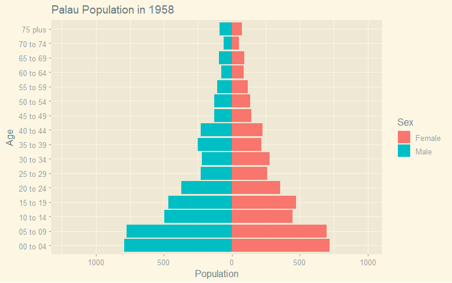

# Introduction

In this short workbook, we outline how using R we can visualise and explore the various ways to understand the structure and growth of the Palauan population. The data source is the Demographic Statistics Database of UNData [@unitednations2022]. What we aim to do is compute the growth rates and visualise the changing population pyramid.

# Code

Below is the code used to achieve this analysis.

## Loading Packages

First we load the tidyverse() library of R packages [@tidyverse], which includes the ggplot2() package [@ggplot2], the dplyr() package [@dplyr]. We also use the ggthemes() package for cool styling later [@ggthemes] and the gganimate() package for outputting animated graphics [@gganimate].

```{r load_packages, message=FALSE, warning=FALSE}
library(tidyverse)
library(gganimate)
library(gt)
library(ggthemes)
```

## Calculating Growth rate

```{r growth_rate_data, message=FALSE}
# load data
pop_size = read_csv("data/total_pop.csv")

# output table
pop_size %>%
  gt() %>%
  tab_style(style = cell_fill(color = "#1F78B4"),
            locations = cells_column_labels(columns = 1:8))
```

```{r growth_rate_calculate}
# create new data frame to track intervals
growth_rates = data.frame(
  StartYear = pop_size$Year[-1],
  EndYear = pop_size$Year[-length(pop_size$Year)],
  StartYearPop = pop_size$Value[-1],
  EndYearPop = pop_size$Value[-length(pop_size$Value)]
)

# calculate yearly crude growth rate
growth_rates$GrowthRate = log(growth_rates$EndYearPop / growth_rates$StartYearPop) / (growth_rates$EndYear - growth_rates$StartYear) * 100

# output table
growth_rates %>%
  gt() %>%
  tab_style(style = cell_fill(color = "#1F78B4"),
            locations = cells_column_labels(columns = 1:5))
```

## Doubling / Halving Time

```{r half_and_double}
growth_rates$DoublingTime = NA  # fill "DoublingTime" column with na
growth_rates$HalvingTime = NA   # fill "HalvingTime" column with na

# calculate "DoublingTime" and "HalvingTime" based on "GrowthRate"
for (i in 1:nrow(growth_rates)) { # do this for every roe
  gr = growth_rates$GrowthRate[i]
  
  # calculate "DoublingTime" for positive growth rates
  if (gr > 0) {
    growth_rates$DoublingTime[i] = log(2) / (gr / 100)
  }
  
  # calculate "HalvingTime" for negative growth rates
  if (gr < 0) {
    growth_rates$HalvingTime[i] = log(0.5) / (gr / 100)
  }
}

# output results
growth_rates %>%
  gt() %>%
  tab_style(style = cell_fill(color = "#1F78B4"),
            locations = cells_column_labels(columns = 1:7))
```

## Dependency Ratio

```{r population_data, message=FALSE}
# load raw population tables
population_data = read_csv("data/pop_pyramid.csv") %>%
  as_tibble()

# output table
population_data %>%
  gt() %>%
  tab_options(ihtml.active = TRUE,
              ihtml.use_page_size_select = TRUE)
  

```

```{r pop_pyramid_dependency}
# define the vector of working age groups
working_age = c("20 to 24",
                 "25 to 29",
                 "30 to 34",
                 "35 to 39",
                 "40 to 44",
                 "45 to 49",
                 "50 to 54",
                 "55 to 59",
                 "60 to 64")

youth_age = c("00 to 04",
              "05 to 09",
              "10 to 14",
              "15 to 19")

old_age = c("65 to 69",
            "70 to 74",
            "75 plus")

# Calculate the youth dependency ratio
youth_dependency = population_data %>%
  group_by(Year) %>%
  summarize(YDR = sum(Value[Age %in% youth_age]) /
              sum(Value[Age %in% working_age]))


# calculate the old age dependency ratio
old_age_dependency = population_data %>%
  group_by(Year) %>%
  summarize(ODR = sum(Value[Age %in% old_age]) /
              sum(Value[Age %in% working_age]))

# calculate the total dependency ratio, could also just add the last two lol
total_dependency = population_data %>%
  group_by(Year) %>%
  summarize(TDR = sum(Value[Age %in% youth_age | Age %in% old_age]) /
              sum(Value[Age %in% working_age]))

# merge the results into one dataframe
dependency_ratios = youth_dependency %>%
  left_join(old_age_dependency, by = "Year") %>%
  left_join(total_dependency, by = "Year")


# output results
dependency_ratios %>%
  gt() %>%
  tab_style(style = cell_fill(color = "#1F78B4"),
            locations = cells_column_labels(columns = 1:4))
```

## Median Age

```{r median_age}

# set mid points for age
age_mapping <- c(
  "00 to 04" = 2,
  "05 to 09" = 7,
  "15 to 19" = 17,
  "65 to 69" = 67,
  "70 to 74" = 72,
  "75 plus" = 80
)

# calculate median
median_age_data <- population_data %>%
  mutate(Numeric_Age = age_mapping[Age]) %>%
  filter(!is.na(Numeric_Age)) %>%
  group_by(Year) %>%
  summarize(Median_Age = weighted.mean(Numeric_Age, Value, na.rm = TRUE))

# output results
median_age_data %>%
  gt() %>%
  tab_style(style = cell_fill(color = "#1F78B4"),
            locations = cells_column_labels(columns = 1:2))

```

## Population Pyramids

```{r pop_pyramid_gif, message=FALSE}
# create ggplot object 
pop = ggplot(data = population_data, aes(
  x = as.factor(Age),
  y = ifelse(Sex == "Male",-Value, Value),
  fill = as.factor(Sex))) +
  geom_col(aes(group = as.factor(Age))) +
  coord_flip() +
  xlab("Age") +
  ylab("Population") +
  # get rid of the male negative effect
  scale_y_continuous(labels = abs) + 
  theme_solarized_2() +
  # set "Year" as the transition state
  transition_states(Year, transition_length = 2, state_length = 1) +
  labs(title = 'Palau Population in {closest_state}',
       fill= "Sex") +
  ease_aes('linear')

# save animation
anim_pop = animate(pop)
anim_save(animation = anim_pop, filename ="pop_pyramid.gif")
```



```{r pop_pyramid_every_year}
# loop through each unique year
for (year in unique(population_data$Year)) {
  # filter data for the current year
  year_data = subset(population_data, Year == year)
  
  # create the population pyramid plot for the current year
  population_plot = ggplot(year_data, aes(
    x = as.factor(Age),
    y = ifelse(Sex == "Male",-Value, Value),
    fill = as.factor(Sex))) +
    geom_col(aes(group = as.factor(Age))) +
    coord_flip() +
    xlab("Age") + 
    ylab("Population") +
    labs(title = 'Palau Population in ', year, fill= "Sex") +
    # get rid of the male negative effect
    scale_y_continuous(labels = abs) +
    theme_solarized_2()

  # save the plot as a .png file with the year in the filename
  filename = paste("pop_pyramid_", year, ".png", sep = "")
  ggsave(filename, plot = population_plot, width = 10, height = 10)
}

```

## [Return to Homepage](index.html)

# Bibliography
