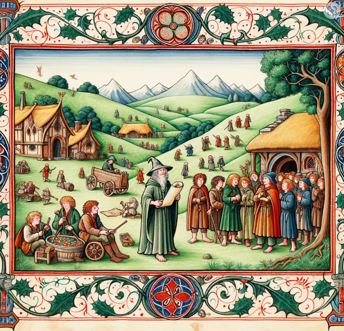
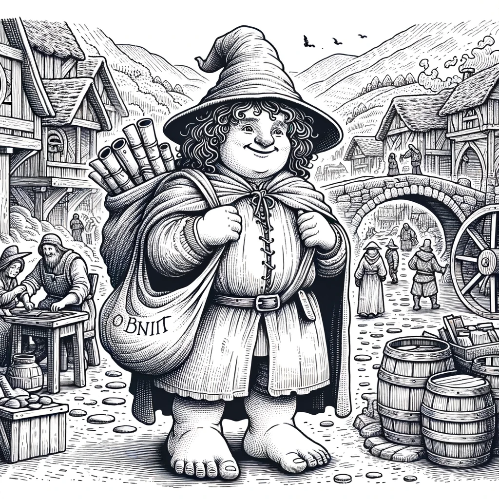

```{r setup, include=FALSE}
knitr::opts_chunk$set(echo = TRUE)
```

# Introduction

In the pleasant lands of the Shire, it has been a time-honoured tradition to gather a tally of its humble folk, though not always with consistent regularity. This tome delves into the census taken in the year of Shire Reckoning (S.R.) 1252, which in the common reckoning translates to the Third Age (T.A.) 2852.  This was during the Thainship of the 26th Thain - Gerontius Took, elsewise known as "The Old Took". Further, those well-versed in the annals of the Baggins' lineage might recall that this is the birth year of Belladonna Baggins (birth name Took), the venerable mother of the famous Bilbo Baggins. It is of note to remember that this was a time roughly two centuries prior to the Shire's territorial stretch into Westmarch, under the decree of the honourable King Elessar in S.R. 1452/F.A. 31. Likewise, this was around one century or generation after the painful Long Winter of S.R. 1158 when many folk of the Shire perished from famine.

The undertaking of the census spanned the course of four moons and was pursued in tandem across Northfarthing, Eastfarthing, Southfarthing, and Westfarthing by distinct teams of coordinators under guidance from the Thain. The infomation gathered encompassed: the count of the folk by gender, age, household, and vocation; the structure of families by the count of offspring per matriarch (detailed by gender and age), and the marital status of couples. Alas, due to the scarcity of means, a post-tally survey was not to be.

The findings were meticulously chronicled in a tome, destined primarily for the archives of the principal town of Michel Delving.



# Loading Packages

```{r load_packages, message=FALSE, warning=FALSE}
library(tidyverse)
library(gt)
library(ggthemes)
```

# Loading Tally

```{r load_tally, message=FALSE}
shire_tally = read_csv("data/shire_folk.csv")
matriarch = read_csv("data/matriach_shire.csv")
```

## Folk Details

```{r folk_details}
shire_tally %>%
  gt() %>%
  tab_style(style = cell_fill(color = "#32CD32"),
            locations = cells_column_labels(columns = 1:5))
```

## Matriarch Details

```{r matriach_details}
matriarch %>%
  gt() %>%
  tab_style(style = cell_fill(color = "#32CD32"),
            locations = cells_column_labels(columns = 1:3))
```

# Determining a Folk Tower

In the serene glades of Rivendell, during the year S.R. 381 or T.A. 1981, emerged a creation of profound insight: the "Folk Tower" or "Liëtaras" in Quenya. Conceived by the illustrious Elven scholar, Aydrolwin Quetelsys, this tower was not of stone or wood, but of knowledge and understanding. Drawing inspiration from the ebb and flow of life, Aydrolwin crafted a diagram that mirrored the ages and genders of this world. Its layered structure depicted the young at the base, ascending to the elders at the pinnacle. Truly, a wonder inscribed upon parchment.

```{r population_tower}
# merge 0 and 1 age groups
shire_tally_toplot = shire_tally %>% select(Age,
                                            Population_Women, 
                                            Population_Men)
shire_tally_toplot[1,] = shire_tally_toplot[1,] + shire_tally_toplot[2,]
shire_tally_toplot = shire_tally_toplot[-2,] # remove the second row
shire_tally_toplot$Age[1] = 0

# make data long
shire_tally_toplot = shire_tally_toplot %>%
  gather(key = "Sex", value = "Population", -Age)

# convert "Population_Men" and "Population_Women" to "Men" and "Women"
shire_tally_toplot$Sex = gsub("Population_", "", shire_tally_toplot$Sex)

# plot tower
folk_tower = ggplot(shire_tally_toplot, aes(
    x = as.factor(Age),
    y = ifelse(Sex == "Men",-Population, Population),
    fill = as.factor(Sex))) +
    geom_col(aes(group = as.factor(Age))) +
    coord_flip() +
    xlab("Age") + 
    ylab("Population") +
    labs(title = "Folk Tower/Liëtaras of the Shire",
         subtitle = "For S.R. 1252", 
         fill= "Sex") +
    # get rid of the male negative effect
    scale_y_continuous(limits = c(-30000, 30000)) +
    theme_solarized_2()

folk_tower
```

# Determining Perishing Levels

Many scholars have pondered upon a somber measure known as the "Fundamental Perishing Level." Far from the tales of valour and triumph, this metric unveiled the inexorable drum beat of death that calls upon all mortal men. It chronicled the cadence at which the Free Peoples will meet their end. Wise minds would consult this gauge, discerning the ebb of life within their realms.

```{r mortality}
crude_death_rate = (sum(shire_tally$Deaths_Women) + sum(shire_tally$Deaths_Men)) / 
  (sum(shire_tally$Population_Men) + sum(shire_tally$Population_Women)) * 1000

paste0("Shire Fundamental Perishing Level for S.R. 1252 is: ", round(crude_death_rate, 2), " per one thousand heads")
```

# Determining Grand Childbearing Levels

Between the mountains and meadows, learned scholars spoke of the "Grand Childbearing Level." A measure not of lands or gold, but of life's most sacred gift -- offspring. Throughout the Ages, kingdoms rose and waned, and so did the numbers of their folk. This level reflected the heartbeats of nations, the silent promise of generations yet unborn.

```{r fertility}
# add population of women
population_women = shire_tally %>% select(Population_Women, Age)
matriarch = matriarch %>% left_join(population_women, by = 
                                     c("Age_of_Mother" = "Age"))

# tfr
matriarch$total_births = matriarch$Births_Girls + matriarch$Births_Boys
matriarch$asfr = matriarch$total_births /  matriarch$Population_Women

paste("Shire Grand Childbearing Levels for S.Y. 1252: ", 
      round(sum(matriarch$asfr * 5), 2), "births per woman")
```



# [Return to Homepage](index.html)
