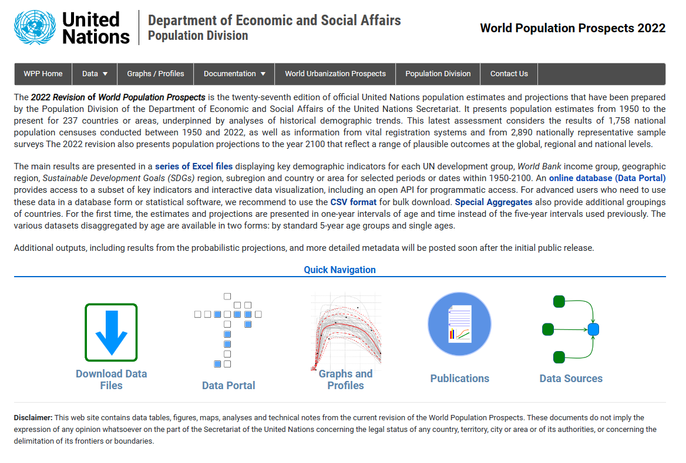

# Introduction

In this short workbook, we outline how using R we can visualise and compare the various computations of the Palau TFR overtime. The data source is the World Population Prospects, @unitednations2022. What we aim to do is compare the different estimates with the aggregate WPP estimates.

[](https://population.un.org/wpp/)

# Code

Below is the code used to build the scatter plot comparison.

## Loading the Packages

First we load the tidyverse() library of R packages [@tidyverse], which includes the ggplot2() package [@ggplot2], the dplyr() package [@dplyr], and the plotly() package [@plotly]. We also use the ggthemes package for cool styling later [@ggthemes].

```{r load_packages, message=FALSE, warning=FALSE}
library(tidyverse)
library(ggthemes)
library(plotly)
```

## Loading the data

Next we load our two .csv data into R as two tibble objects. One, "e_tfr" is a compilation of all the different estimates for TFR by data source and method. The tibble has four columns: "data_souce, estimate_method, estimated_tfr, estimated_year". The other, "wpp_tfr" is the WPP approximations for TFR 1960-2020 @unitednations2022

```{r load_data, message=FALSE}
# load the estimated tfr
e_tfr = read_csv("data/tfr_estimates.csv") %>%
  as_tibble() 

# load the approx tfr 
wpp_tfr = e_tfr %>% filter(data_source == "WPP")
```

## Static Plots

Now, we use ggplot2() to compute the first static data visualisation. This shows all the different estimated TFR from the 'e_tfr' tibble.

```{r first_static, fig.width=12,fig.height=13}
# create the scatter plot
est = ggplot(e_tfr) +
  geom_line(aes(x = estimated_year,
                y = estimated_tfr,
                color = interaction(estimate_method, data_source))) +
  labs(x = "Estimated Year",
       y = "Estimated TFR",
       title = "Plot of TFR Estimates of Palau 1950-2020",
       color = "") +
  theme_solarized_2() +
  theme(legend.position = "bottom",
        legend.box = "vertical",
        legend.margin = margin()) +
  guides(color = guide_legend(nrow = 18, byrow = TRUE))

est
```

The next visualisation shows the estimates with just the WPP approximations

```{r second_, fig.width=12,fig.height=7}
# create the scatter plot
wpp = ggplot(wpp_tfr, aes(x = estimated_year,
                          y = estimated_tfr,
                          color = "black"))+
  geom_line() +
  labs(x = "Estimated Year",
       y = "Estimated TFR",
       title = "WPP TFR Estimates for Palau 1950-2020",
       color = "") +
  theme_solarized_2() +
  theme(legend.position = "none")
wpp
```

## Make interactive

Using the ggplotly function from the plotly package, we can make the plot interactive so it is possible to select which data you want to see and zoom + export a custom png. This is very challenging however and could also probably be achieved in Shiny with more ease (though I would have to host a backend which can be \$\$\$)

```{r interactive_plot, fig.width=12,fig.height=13}
est_plotly = ggplotly(est, width = 800, height = 2000)


# Create a list of buttons
buttons = list()

# Access the levels of the color scale for the correct order
unique_combinations = unique(e_tfr[c("estimate_method", "data_source")])
unique_combinations = unique_combinations[order(unique_combinations$data_source,
                                                unique_combinations$estimate_method), ]
unique_combinations = apply(unique_combinations, 1,
                            function(row) paste(row, collapse = "-"))

# Create a button for each level in the correct order
for (i in seq_along(unique_combinations)) {
  visibility_vals = rep(FALSE, length(unique_combinations))
  visibility_vals[i] = TRUE
  buttons[[length(buttons) + 1]] = list(
    method = "restyle",
    args = list("visible", visibility_vals),
    label = unique_combinations[i]
  )
}

# add a button to show all interactions
buttons[[length(buttons) + 1]] = list(
  method = "restyle",
  args = list("visible", rep(TRUE, length(unique_combinations))),
  label = "Show All"
)

# adjust layout
est_plotly = est_plotly %>% 
  layout(
    showlegend = FALSE,
    updatemenus = list(
      list(
        type = "buttons",
        direction = "down",
        y = -0.1,
        x = 0,
        xanchor = 'left',
        yanchor = 'top',
        buttons = buttons,
        tickfont = list(size = 5),    # adjust button font size
        pad = list(r = 10, t = 10),   # adjust padding
        showactive = TRUE
      )
    ),
    margin = list(
    b = 800  # adjust bottom margin to make space for buttons
    )
  )

# display the plot
est_plotly

```

## Difference WPP and Estimates

Now I want to compute and visualise the difference betweent the WPP line and the different estimates

```{r differnce_calculation}
# drop WPP from data
calc_tfr = e_tfr %>% filter(data_source != "WPP")

# change cols in wpp
wpp_tfr = wpp_tfr %>% select(estimated_year, estimated_tfr) %>%
  rename(estimated_year = estimated_year, wpp_tfr = estimated_tfr)

# calc difference
calc_tfr = calc_tfr %>%
  left_join(wpp_tfr, by = "estimated_year") %>%
  mutate(difference = estimated_tfr - wpp_tfr)
```

We can visualise this data per year of estimate as a simple point and line of best fit graph

```{r animated_histogram, fig.width = 12, fig.height = 12}
difference_model = lm(difference ~ estimated_year, data = calc_tfr)
r_squared = summary(difference_model)$r.squared

ggplot(calc_tfr, aes(x = estimated_year,
                     y = difference,
                     color = estimate_method,
                     shape = factor(data_source),
                     group = 1)) +
  geom_point() +
  geom_smooth(method = "lm",
              se = FALSE,
              color = "red",
              alpha = 0.3) +
  scale_shape_manual(values = c(1, 2, 3, 4, 5, 6, 7, 8, 9, 10, 11, 12, 13, 14)) +
  labs(title = "Scatter Plot with Line of Best Fit",
       color = "Estimate Method",
       shape = "Data Source") +
  xlab("Year of Estimate") +
  ylab("Difference better Estimated TFR and WPP estimate") +
  geom_text(aes(x = max(estimated_year), y = min(difference), 
                label = paste("R\u00B2 =", round(r_squared, 2))),
            hjust = 1, vjust = -1, color = "dark red") +
  geom_text(aes(x = max(estimated_year), y = min(difference) + 0.1, 
                label = paste("Regression Formula: ",
                              round(coefficients(difference_model)[1], 2),
                              round(coefficients(difference_model)[2], 2),
                               "x")),
            hjust = 1, vjust = -1.5, color = "dark red") +
  theme_solarized_2()
```

# Homepage

## [Return to Homepage](index.html)

# Bibliography
